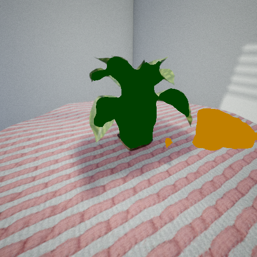

# Sensors Tools

This repository offers a generic sensor interface for RGB-D semantic ROS 2 messages.
It mainly tackles the problem of bridging semantic measurements from simulators, datasets, other ROS 2 frameworks.

<p float="center" align="middle">
  
   
  
</p>

## Installation

Clone the repository with:

```
git clone https://github.com/anonym/sensors_tools
```

First install your CUDA compatible Pytorch following the [official docs](https://pytorch.org/get-started/locally/).
Then, you can install the required dependencies and the python package with:

```
pip install . (use -e for installing an editable version in case you want to modify / debug)
```

**If you want to use Trident:** Download SAM checkpoints with `download_sam_weights.sh` and configure the path in the config file.

## Structure
- `sensors_tools/`:
  - `base/`: general classes.
  - `bridges/`: classes to interface with simulators, datasets, ROS...
  - `utils/`: general functions or tool classes.
  - `inference/`: module to store inference models (currently mainly aimed at semantic segmentation), loading them for inference with a general interface.
  - `sensor.py`: a generic sensor that loads: a bridge as a data interface, (optionally) an inference module to obtain data from neural networks.
- `sensor_tools_ros/`:
  -  `config/`: folder with the main configurations for running the sensor ROS node.
  -  `semantic_ros.py`: main node for using the `sensor.py` within ROS.

## Configuration

For the configuration, this repository follows the approach of keeping `{Class}Config` dataclasses that are used for typing and defaults. 
The config objects are used to configure an instantiated class. In ROS, this configuration is input using a `.yaml` file (check `semantic_ros.py`).

## Usage

The intended usage is by running the `sensor` node with `rosrun` or using a launch file:

```
roslaunch sensors_tools_ros semantic_sensor.launch
```

## Acknowledgements

**Trident** is based on the original [repository (commit 5803ae)](https://github.com/YuHengsss/Trident/commit/5803ae4b4e1251d782298a7a426707ae55360c9f). The configuration for the detected classes was changed to use the `sensor` config interface. The `dataset_type` changed to pascal_voc and cityscapes to align with our naming. `model_type` changed to `clip_model_type`.

**NARADIO** is based on the RayFronts [repository (commit 0ad5c23)](https://github.com/RayFronts/RayFronts/tree/0ad5c23bb6fe8d0c17f1269ddd3ec355e1d8c52f). It extracts patch features from the Nvidia RADIO model enabling CLIP and SigLIP adaptors for language alignment.